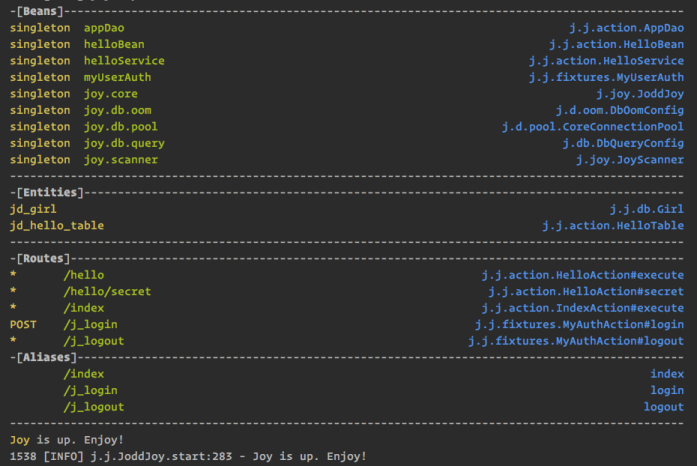

# Jodd Joy

*Jodd* *Joy* is a predefined bundle of *Jodd* micro-frameworks, ready to be used. With *Joy* you can start developing your *Jodd* apps right away, with minimal configuration.

There are two ways how you can start *Joy*:

1. as a Web application,
2. using the Joy Boot!

Check out the [tutorial](http://joddframework.org), to see it in action.

## Quick start

Just register the `JoyContextListener`. That is all. You can add it either in `web.xml` or register manually or use `@WebListener` annotation - it's up to you.

~~~~~ xml
	<web-app>
		<listener>
			<listener-class>jodd.joy.JoyContextListener</listener-class>
		</listener>
		...
~~~~~

Run the servlet container and enjoy!

## Joy Boot!

Joy Boot is a new feature and it is a subject to change.
{: .attn}

Create your web app:

~~~~~ java
	public class MyWebApp {
		public static void main(String[] args) {
			Server.create()
					.setPort(8080)
					.start();
		}
	}
~~~~~

Add dependency in Gradle on Tomcat or Jetty variant of Bootstrap:

~~~~~
	apply plugin: 'java'
	apply plugin: 'application'

	dependencies {
	    compile project(":joy-boot-tomcat8")
	//    compile project(":joy-boot-jetty9")
	}

	mainClassName = "...MyWebApp"
~~~~~

Finally:

~~~~~ bash
	gradlew run
~~~~~

Done!

## Joy output

On the output, *Joy* will print the quick summary of all registered components: *Petite* beans, *DbOom* entities and *Madvoc* actions. Something like:

Enjoy!