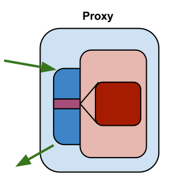

# ProxyProxetta

Once when pointcuts and advices are defined, it is easy to define a
proxy aspect itself:

~~~~~ java
    ProxyAspect aspect = new ProxyAspect(LogProxyAdvice.class, pointcut);
~~~~~

`ProxyAspect` is just a simple holder of advice and pointcuts, used for
creating `Proxetta` implementations.

This page explains `ProxyProxetta`, but many things here are common for
other *Proxetta* types as well.
{: .attn}

## Creating Proxetta

First step is to create and configure *Proxetta*. For the simplicity,
all *Proxetta* implementations have static builder methods:
`withAspects()`.

So, lets create new `ProxyProxetta`:

~~~~~ java
    ProxyProxetta proxetta = ProxyProxetta.withAspects(aspect);
~~~~~

Of course, you could use the constructor instead.

Now it's time to configure created *Proxetta*.

## Proxetta configuration

Each `Proxetta` implementation share the same set of properties.

### forced

Specifies \'forced\' mode. If `true`, the new proxy class will be
created even if there are no matching pointcuts. Otherwise, new proxy
class will be created only if there is at least one matching pointcut.

### classLoader

Specifies classloaders for loading created classes.

### variableClassName

Defines variable proxy class name, so every time when new proxy class is
created its name will be different. Therefore, one classloader may load
it without a problem. If this flag is not set, proxy class name will be
constant; Such class can be loaded only once by a classloader.

### classNameSuffix

Defines class name suffix of generated classes.

### debugFolder

When debug folder is set, *Proxetta* will save all classes upon their
creation into that folder. Very useful for debugging purposes!

## Creating Builder

Once when `Proxetta` is created and configured, we can use it multiple
times to create a **builder**. *Proxetta* builders are responsible for
creating classes using bytecode manipulation.

*Proxetta* builder is created with method `builder()`.

For the builder we must first define the target class/name or target
input stream that will be processed. This is done by set of
`setTarget()` methods. Once target is defined, builder can build a
proxy.

For the simplicity, there are shortcuts: overloaded `builder` methods,
that batch invocation of `builder` and `setTarget` methods.

## Generating class

The following builder methods are available for creating class:

* `create` - generates class and returns its `byte[]` content.
* `define` - loads created class bytes and returns as a `Class`.
* `newInstance` - instantiates default constructor for defined class.

Finally, lets continue our example:

~~~~~ java
    Class fooClass = proxetta.builder(Foo.class).define();
~~~~~

or, directly an instance:

~~~~~ java
    Foo foo = proxetta.builder(Foo.class).newInstance();
~~~~~

Note: generated classes do not contain any debug information to avoid
`ClassFormatError`. Some 3rd party tools (like Emma) may loose some
local variable information.
{: .attn}

## ProxyProxetta overview

`ProxyProxetta` extends target class. Pointcut method are overriden in
proxy. During the execution of adviced code in generated method, target
method is called using `super` reference. Proxy methods has the same
annotations as the target methods.

Proxy class has the same constructors as the target class. It is also of
the same type as the target class, so it can easily can be used instead.

Obviously, you can't proxy interfaces or abstract methods.

## Proxy name

By default, proxy name is created from target class name, by appending
default suffix. Suffix name can be changed. Moreover, if variable names
feature is turned on, added suffix is changed each time by appending
auto-incrementing number. In all cases, proxy class is in the same
package as target class.

Sometimes it is needed to have more control over proxy class name and
package. This is especially important when proxyfing JDK classes, since
default classloader doesn't allow to instantiate anything from `java.*`
package.

*Proxetta* allows to completely control proxy names. Every method for
proxy definition and proxy creation accept second argument that defines
proxy name in the following ways:

* `.Foo` (class name starts with a dot) - proxy package name is equal to
  target package, just proxy simple class name is set.
* `foo.` (class name ends with a dot) - proxy package is set, proxy
  simple name is create from target simple class name (suffix is
  appended).
* `foo.Foo` - full proxy class name is specified (suffix is appended).

Adding suffix can be also completely disabled, but in that case
different package for proxy class must be provided, since it is not
possible to define two classes with the same package and simple names.

Proxy name is set on builder using `setTargetProxyClassName()`.

## Integration with Petite

It is easy to apply aspects on beans registered in the
[*Petite*](/petite/) container transparently. *Petite* has
single point method for beans registration. User may override this
method and create proxy for each bean type before it is actually
registered in the container:

~~~~~ java
    public class MyPetiteContainer extends PetiteContainer {

    	protected final ProxyProxetta proxetta;
    	public MyPetiteContainer(ProxyProxetta proxetta) {
    		this.proxetta = proxetta;
    	}

    	@Override
    	protected BeanDefinition registerPetiteBean(
    			String name,
    			Class type,
    			Class<? extends Scope> scopeType,
    			WiringMode wiringMode) {

    		if (name == null) {
    			name = PetiteUtil.resolveBeanName(type);
    		}

    		ProxyProxettaBuilder builder = proxetta.builder();
    		builder.setTarget(type);
    		type = builder.define();

    		return super.registerPetiteBean(name, type, scopeType, wiringMode);
    	}
    }
~~~~~

Attention with bean name: since `Proxetta` modifies the name of class
that will be modified, bean name has to be resolved **before** proxy is
defined on the type.
{: .attn}

Here *Proxetta* instance as well as advices and pointcuts are created
outside the container.
